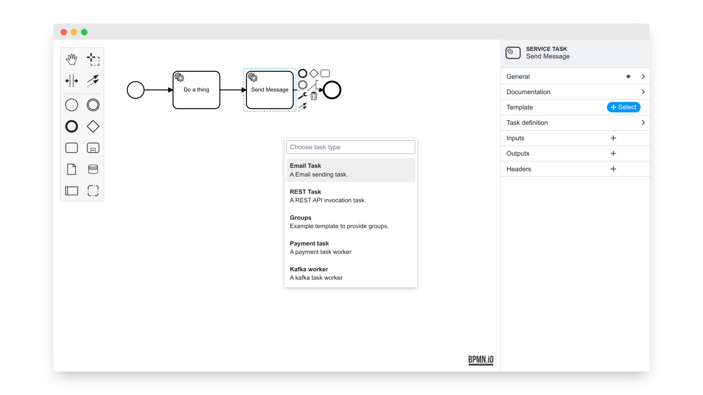

# `@bpmn-io/element-template-chooser`

[](https://github.com/bpmn-io/element-template-chooser/actions/workflows/CI.yml)

A simple element template chooser for [`properties-panel >= 1`](https://github.com/bpmn-io/bpmn-js-properties-panel).




## Usage

```javascript
import BpmnModeler from 'bpmn-js/lib/Modeler';

import '@bpmn-io/element-template-chooser/dist/element-template-chooser.css';

import ElementTemplateChooserModule from '@bpmn-io/element-template-chooser';

const modeler = new BpmnModeler({
  additionalModules: [
    ...
    ElementTemplateChooserModule
  ],
  ...
});

// load templates
modeler.on('elementTemplates.errors', event => {
  const { errors } = event;

  showTemplateErrors(errors);
});

modeler.get('elementTemplatesLoader').setTemplates(ELEMENT_TEMPLATES_JSON);

// choose via the properties panel, _OR_
// open the chooser programmatically for a given element
const template = await (
  modeler.get('elementTemplateChooser').open(element)
);
```


Checkout [`./example`](./example) for a full featured integration example.


## Run locally

To run the [example app](./example), execute:

```
npm start
```


## License

MIT
