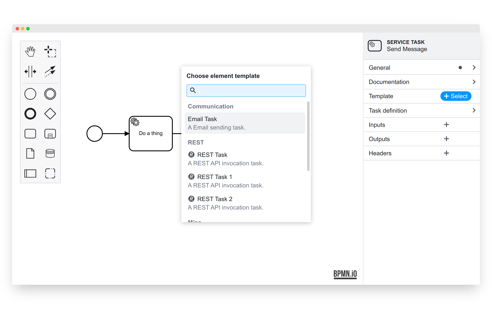

# `@bpmn-io/element-template-chooser`

[](https://github.com/bpmn-io/element-template-chooser/actions/workflows/CI.yml)

A simple element template chooser for [`properties-panel >= 1`](https://github.com/bpmn-io/bpmn-js-properties-panel).




## Usage

```javascript
import BpmnModeler from 'bpmn-js/lib/Modeler';

import ElementTemplateChooserModule from '@bpmn-io/element-template-chooser';

const modeler = new BpmnModeler({
  additionalModules: [
    ...
    ElementTemplateChooserModule
  ],
  ...
});

// load templates and choose via the properties panel
modeler.on('elementTemplates.errors', event => {
  const { errors } = event;

  showTemplateErrors(errors);
});

modeler.get('elementTemplatesLoader').setTemplates(ELEMENT_TEMPLATES_JSON);

// alternatively, choose programmatically
// from a given list of element templates
const task = modeler.get('elementRegistry').get('MyTask');

const task = await (
  modeler.get('elementTemplateChooser').choose(task, ELEMENT_TEMPLATES_JSON)
);
```


## Run locally

To run the [example app](./example), execute:

```
npm start
```


## License

MIT